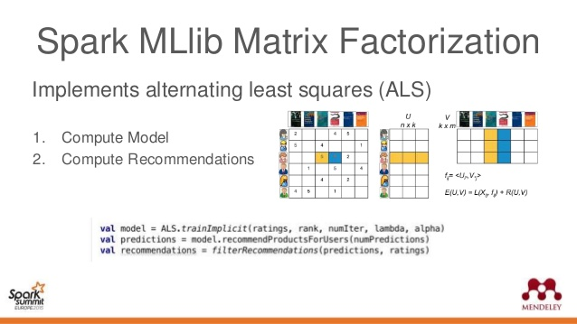

# Matrix Factorization with Alternating Least Squares

## Introduction
In this lesson, we will look at another matrix factorization technique called Alternating Least Squares (ALS). This method can prove to be much more effective and robust than SVD we saw earlier. ALS allows you to set regularization measures and minimize a loss function while optimizing the model parameter `k`.  We will briefly look at the maths behind this approach in this lesson, before putting it into practice next. 

## Objectives

You will be able to:

- Introduce a learning function for optimal matrix decomposition
- Learn how ALS functions by alternating between two regularization parameters to reduce loss
- Understand how ALS is implemented in Spark. 

## Recap Matrix Factorization

In past few lessons, we leaned that Matrix factorization functions with following assumptions:

- Each user can be described by k attributes or features. 

For example, in last lab where we set k=200, feature 1 could be a number that says how much each user likes sci-fi movies. 2, how much he/she likes horror movies and so on. 

- Each item can be described by an analagous set of k attributes or features. 

For our MovieLens example, feature 1 for chosen movie might be a number that says how close the movie is to pure sci-fi.

> __If we multiply each feature of the user by the corresponding feature of the item and add everything together, this will be a good approximation for the rating the user would give to that item.__

## Introducing a Learning Function 

The simplicity im MF is that we do not have know what these features are. Nor do we know how many (k) features are relevant. We simply pick a number for $k$ and learn the relevant values for all the features for all the users and items. 

__How do we integrate learning into this problem? By minimizing a loss function, of course__

We can turn our matrix factorization approximation of a k-attribute user into math by letting a user $u$ take the form of a k-dimensional vector $x_u$. Similarly, an item i can be k-dimensional vector $y_i$. User u’s predicted rating for item $i$ is just the dot product of their two vectors.

$$r̂_{u,i}=x_u^⊤y_i = \sum_k x_{uk}y_{ki}$$

- $r̂_{u,i}$ represents our prediction for the true rating $r_{ui}$

- $x_u^⊤y_i$ is assumed to be a column (row) vector. 

These user and item vectors are often called latent vectors or **low dimensional embeddings** . The $k$ attributes are called the **latent factors**.

We want our predictions to be as close to the ground truth as possible. Therefore to find the latent vectors we frame it as an optimisation problem using a standard squared loss with regularisation. We will choose to minimize the square of the difference between all ratings in our dataset $S$ and our predictions. 

The Loss function $L$ can be calculated as:

$$ L = \sum_{u,i ∈  S}(r_{u,i}− x_u^T y_i)^2 + λ_x \sum_u||x_u||^2 + λ_y \sum_u||y_u||^2$$

In the equation, we see two L2 regularization terms to prevent overfitting of the user and item vectors. Our goal now is to __minimize this loss function__. This is where __Alternating Least Squares__ (ALS), comes into the equation. 

## Alternating Least Squares

For ALS minimiztion, we hold one set of latent vectors constant. Let's say we pick the item vectors and take the derivative of the loss function with respect to the other set of vectors (the user vectors). We set the derivative equal to zero  and solve for the non-constant vectors (the user vectors). 

Next comes the alternating part. With our new, solved-for user vectors in hand, we hold them constant, instead, and take the derivative of the loss function with respect to the previously constant vectors (the item vectors). 

> __ALS involves alternate back and forth and carry out this two-step dance until convergence.__

Let’s group all the user-factors in an matrix $X$ and all the item-factors in a matrix Y. If we assume either the user-factors or item-factors was fixed, this would look exactly like a regularised least squares problem. 

First lets assume Y is fixed and solve for $x_u$:

__$$x_u=(Y^⊤Y+λI)^{−1}Y^⊤r_u$$__

Likewise if we assume X is fixed, and solve for $y_u$:

$$y_u=(X^⊤X+λI)^−{1}X^⊤r_i$$

Above two steps are iterated until convergence OR some stopping criterion is reached. [Literature on ALS suggests 10 iterations for optimal results](https://endymecy.gitbooks.io/spark-ml-source-analysis/content/%E6%8E%A8%E8%8D%90/papers/Large-scale%20Parallel%20Collaborative%20Filtering%20the%20Netflix%20Prize.pdf). Here is [another good source](https://datajobs.com/data-science-repo/Collaborative-Filtering-[Koren-and-Bell].pdf). 

## ALS vs. SVD

ALS is generally less computationally efficient than directly computing the SVD solution. An interesting results of the SVD decomposition is that we get the complete nested set of low-rank approximations. So if you'd like a rank 5 approximation and a rank 10 approximation, you can just compute the full SVD, grab the top 5 components from that decomposition to form the rank 5 approximation with the lowest MSE and grab the top 10 components for the rank 10 approximation with the lowest MSE. Meanwhile, ALS only gives you a __single rank approximation__. So if you wanted a rank 5 and rank 10 decomposition, you would need to run the ALS algorithm twice.

SVD requires that all entries of the matrix be observed. This is not the case for ALS. Similarly, ALS easily generalizes to higher order cases (i.e., tensors) while SVD does not.

## ALS in Spark 

As we will see in our next lab, Spark's machine learning library `mllib` offers an implementation of alternating least squares algorithm out of the box. It factors the user to item matrix A into the user-to-feature matrix U and the item-to-feature matrix M. It runs the ALS algorithm in a parallel fashion.  The ALS algorithm helps uncover the latent factors for big data in a distributed computation setup. It explain the observed user to item ratings and tries to find optimal factor weights to minimize the least squares between predicted and actual ratings while the data is split in a cluster of computers.

## Additional Resources
- [A detailed explanation of ALS](https://datasciencemadesimpler.wordpress.com/tag/alternating-least-squares/)
- [Great Video on recommendation systems in spark](https://sparkhub.databricks.com/video/a-more-scalable-way-of-making-recommendations-with-mllib/)
- [The maths behind ALS](http://stanford.edu/~rezab/classes/cme323/S15/notes/lec14.pdf)
- [Spark ALS for kaggle Santander competition](https://www.elenacuoco.com/2016/12/22/alternating-least-squares-als-spark-ml/)

## Summary 

In this lesson, we looked at another matrixd factorization technique, called alternating least squares and learned how we can train such a model to minimize a loss function, based on least squares. Let's try what we have seen so far in the spark environment in our last lab for this section. 
